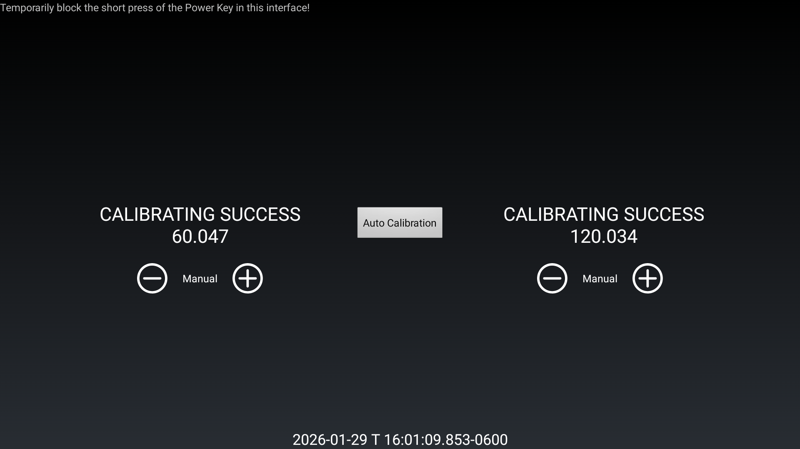
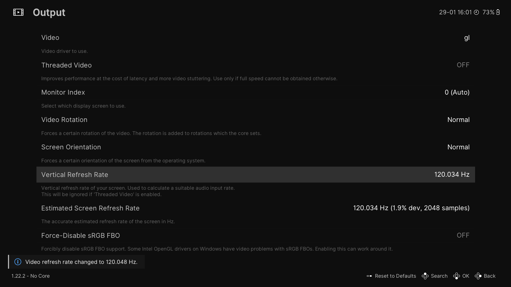
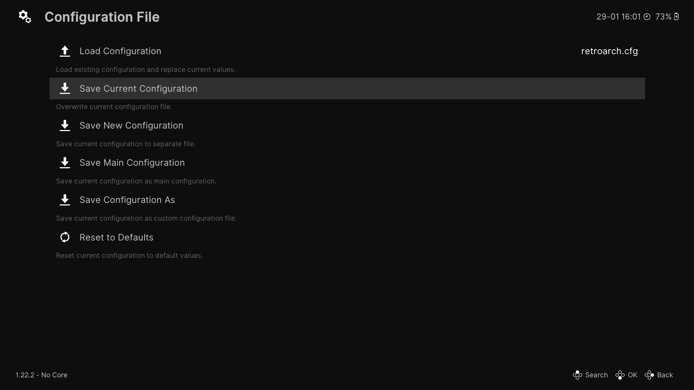
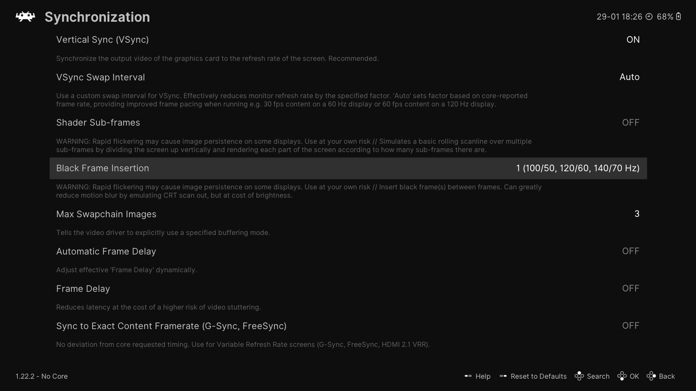
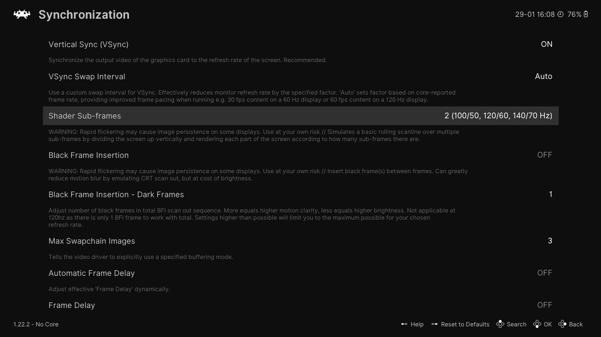
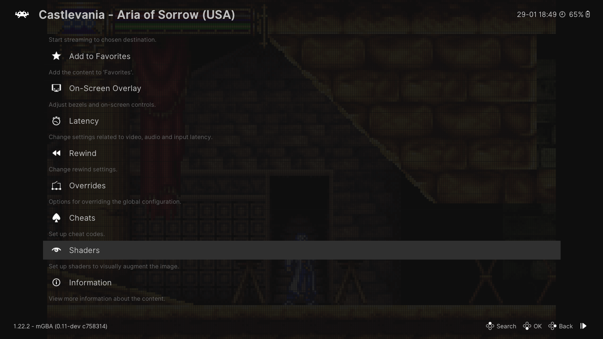
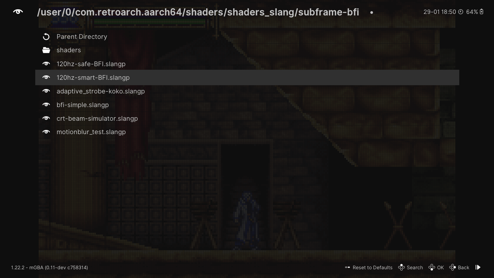
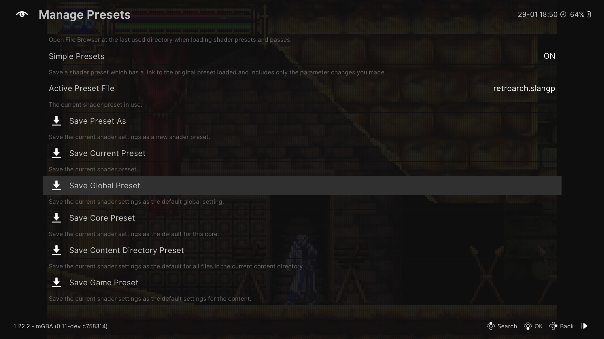

# HOWTO - Configure Black Frame Insertion for RetroArch

This guide will help you configure BFI for RetroArch on devices with 120 Hz handheld screens.

## AYN/Retroid System Setup

For AYN and Retroid devices (Odin 2 Portal, Retroid Pocket 6, etc.), the first thing to do is ensure the screen refresh rate has been calibrated using the built-in tool provided by AYN/Retroid.

1. Open Android Settings, then go to `Odin Settings` and find the `Enter factory test` option. It may be in an `Advanced` tab/submenu.
2. When prompted, tap `OK` to continue.
3. Find and tap the `FPS Calibration` option in the Factory Test menu.
4. Tap the `Auto Calibration` button and let the app run until the FPS numbers stop changing. 
5. Repeat the process until the left value is above and as close to 60.000 as possible, and the right value is as above and as close to 120.000 as possible.

That last step is very important. RetroArch will run the emulation as 1/2 of 120 Hz mode refresh value, so the ideal value is 120. Lower than 120 can cause some issues in RetroArch if it's not configured properly, so just run the calibration a few times until the target numbers are reached.

Finally, make sure the `Smooth Display` option is enabled either via the Quick Settings dropdown or in the `Android Settings > Display` menu.

## RetroArch Setup

> NOTE: This info is current as of RetroArch v1.22.0.

There are a few ways to enable BFI in RetroArch. This part of the guide will assume you've done basic setup of RetroArch to get games running, and your device screen is 120 Hz. Also make sure you've just opened RetroArch and aren't running a game, as that can cause issues saving options to the correct config file.

### Set Refresh Rate in RetroArch

1. In the RetroArch menu, go to `Settings > Video > Output`. 
2. Set the `Vertical Refresh Rate` value.
   - If you've know the precise refresh rate, go ahead and enter that value in `Vertical Refresh Rate`.
   - If you don't know the precise refresh rate, stay on this menu screen for a minute while the `Estimated Screen Refresh Rate` value stablies, then press confirm while `Estimated Screen Refresh Rate` is selected. This will set that estimated value to the `Vertical Refresh Rate` option on this menu. If you went through the `FPS Calibration`, this should be pretty close or exactly the 120 Hz value from that step.
3. Back out of the menus, then go to `Main Menu > Configuration File > Save Current Configuration` to save the changes. 

### Option 1: Use RetroArch BFI Option (OpenGL or Vulkan)

This is the easiet option to enable BFI, though not as flexible as using a BFI shader.

1. In the RetroArch menu, go to `Main Menu > Video > Synchronization`.
2. Set the `Black Frame Insertion` value to `1` for 120 Hz screens. This will automatically disable some features like `Automatic Frame Delay`.  
3. Back out of the menus, then go to `Main Menu > Configuration File > Save Current Configuration` to save the changes.

### Option 2: Use a Subframe BFI Shader (Vulkan only)

Using one of the BFI shaders will give you more control over how BFI works with your device. While being more flexible, it can take some tweaking to get right with some core + shader combinations, and takes a bit more to maintain if you have custom shader settings per system/core in RetroArch. 

#### Enable RetroArch Subframe Shaders

1. In the RetroArch menu, go to `Settings > Video > Synchronization`.
2. Set the `Shader Sub-frames` value to `2` for 120 Hz screens. 
3. (Optional) Subframe BFI shaders work with latency settings like `Automatic Frame Delay`, so it can be enabled while in this menu.
4. Back out of the menus, then go to `Main Menu > Configuration File > Save Current Configuration` to save the changes.

#### Shader Configuration

1. Load a game with one of the stable cores like Snes9x, mGBA, etc.
2. Open the RetroArch Quick Menu (in-game menu), then go to `Shaders`. 
3. Enable shaders by changing `Video Shaders` to `ON`.
4. Go to the `Load Preset` option.
5. From your shader folder, go to `shaders_slang/subframe-bfi`.
6. Select a shader. The `120hz-smart-BFI.slangp` is good to start. 
7. From the `Shaders` menu, go to `Manage Presets`.
8. If this is the only shader in use, save the preset as a global preset. Otherwise, select the appropriate preset type. 

If the option to enable shader doesn't persist on next run, open the Quick Menu and select `Overrides`. Then save the override for that game, core, or content directory.

If you have a saved shader preset, you can use `Shaders > Prepend Preset` to add the BFI shader to your shader configuration.

## BFI Notes

- The [RetroArch BFI Option](#option-1-use-retroarch-bfi-option-opengl-or-vulkan) is the quickest way to get BFI working, and will produce the best motion clarity while also having the lowest brightness.
- The `120hz-smart-BFI.slangp` [subframe shader](#option-2-use-a-subframe-bfi-shader-vulkan-only) produces the same results as the [RetroArch BFI Option](#option-1-use-retroarch-bfi-option-opengl-or-vulkan).
- Some BFI subframe shaders produce higher brightness than others, but may also impact motion clarity compared options that fully blank the screen every other frame. When combined with a CRT or LCD shader, the brightness can be even lower. Experiment with shader paramters and appending/prepending shader presets to find a combination you like.
- If you see flickering while running BFI:
  - Ensure the refresh rate set in RetroArch matches your device. If the value is too far off the screen update timing with be out of sync.
  - Try increasing the system performance mode if available. For example, the Odin 2 Portal could go from Standard to Performance mode.
  - If using a subframe shader, it may require manual tuning of shader parameters. Or try a different subframe BFI shader.
